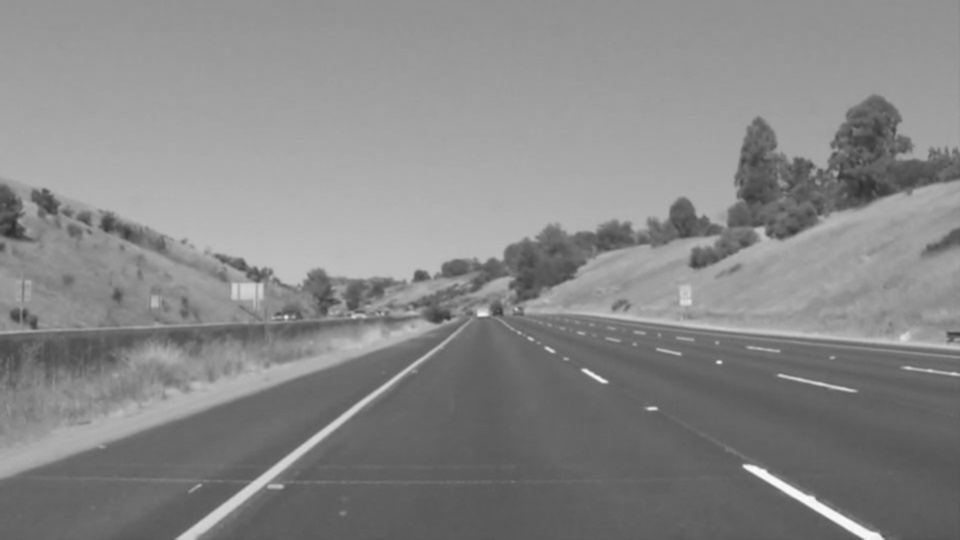
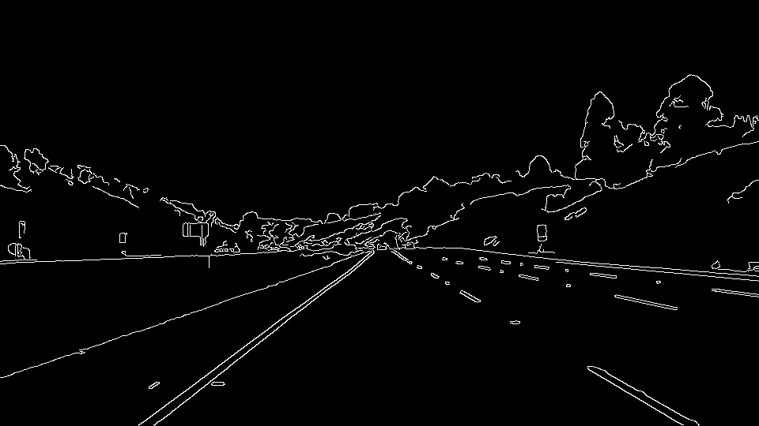
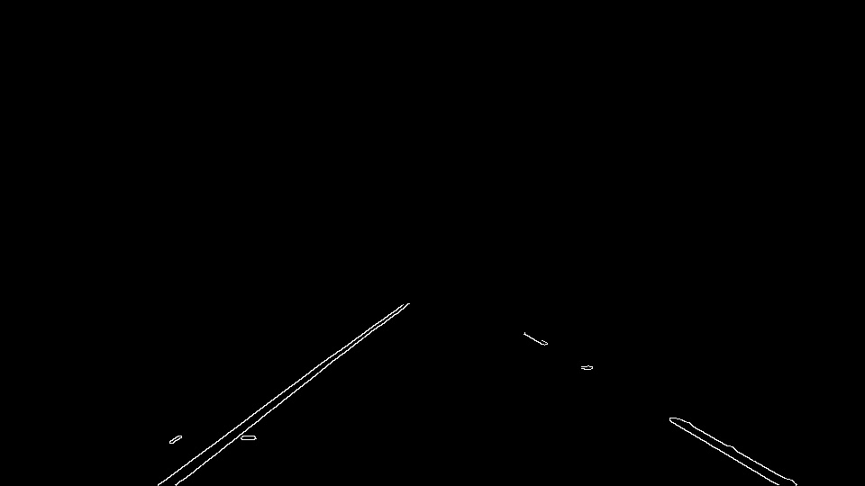
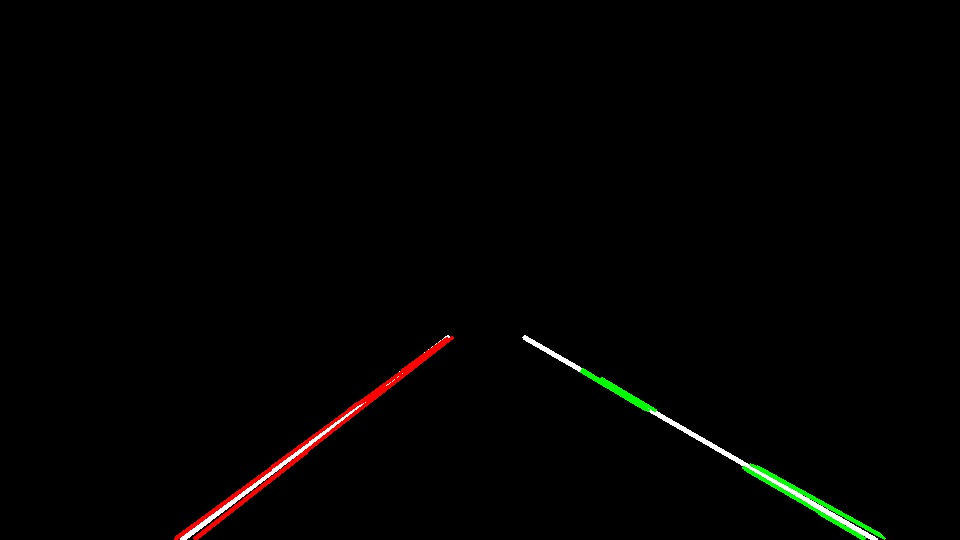
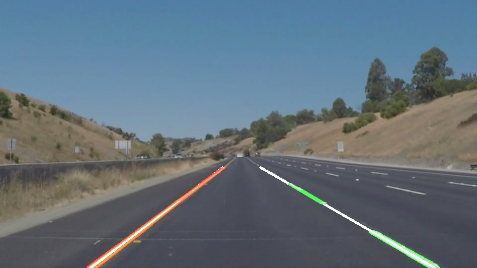

# **Finding Lane Lines** 

## Goals

Project goals:
1. Make pipeline for lane lines detection
2. Apply said pipeline to example images and videos

## Approach

### Pipeline description
The pipeline takes colour image as input. In the video case, each frame is evaluated independently, without regard to preceding and succeeding frames.

The pipeline consists of these steps:
1. Conversion of colour input image to greyscale image
2. Application of Gaussian blur to reduce (high-frequency) noise
3. Edge detection with Canny edge detector
4. Cutting out region-of-interest
5. Line detection with Hough transform
6. Line filtering to produce two lane lines from the lines detected in previous step (if any)

Example series of snapshots from the pipeline is as follows:
1. Input image

2. Greyscale and Gaussian blur

 

3. Canny edge detection
 

4. Region-of-interest
 

5. Line detection
 

6. Line filtering and output

### Modification to `draw_lines` function

Several modifications were made to the `draw_lines` function to filter the many lines produced by the Hough line detection into just two: the left lane and the right lane.

Firstly, the `hough_lines` and the `draw_lines` helper functions were decoupled into `hough_lines_bare` and `draw_lines_filter`. The former outputs raw lines instead of an image with the lines drawn on it, and the latter takes the line descriptions, perform the filtering, and produces the final output. We will now describe the line filtering procedure.

We assume the camera to start in the centre of its lane. As consequence:

1. lane lines cannot be vertical
2. lane lines cannot be horizontal

We use these as the first step of the filtering process. For each line found by the Hough line detector, any lines with 20 [deg] from vertical or 20 [deg] from horizontal are removed.

Next, we divide the remaining lines into the left set and the right set. Lines with negative slopes belong in the left set, while lines with positive slopes belong in the right set. Additionally, left lines must be confined in the left-half of the image, and right lines must be confined in the right-half. Lines with negative slope that start or end in the right-half of the image are excluded. Similarly with lines with positive slope; if they end or start in the left-half, they are excluded.

From the remaining lines, two lane lines are estimated with the `polyfit` function of module `numpy.polynomial.polynomial`, one for the left lane and one for the left. Using the line fit, continuous lines were drawn from the bottom of the image up to the upper limit of the region of interest. In example images above, these estimated lane lines are drawn as thin light grey lines. They are often bordered by red lines (on the left) and green lines (on the right), these are the lines that pass through the filtering process.

### Shortcomings and avenues for improvement

Parameters of this pipeline (Canny thresholds, Hough thresholds, etc) were tuned by hand in a trial-and-error process. They are likely to perform worse in examples taken from a different environment.

Shadows on the road would confuse the line detector, outputting spurious lines. This is most clearly evident in the challenge video.

Temporal knowledge is not used. We would think that a road would not suddenly lose its markings between frames of a reasonably fast camera, and lane markings in the current frame would not differ very far from those from the previous frame.

To improve this pipeline, we can smooth the lane estimate over time and include machine learning approach in the detection process (black-boxy problem notwithstanding).

Personally, I think I might have spent too much time tuning these parameters, while a robust approach is a lesson away. I am looking forward to the next lesson.